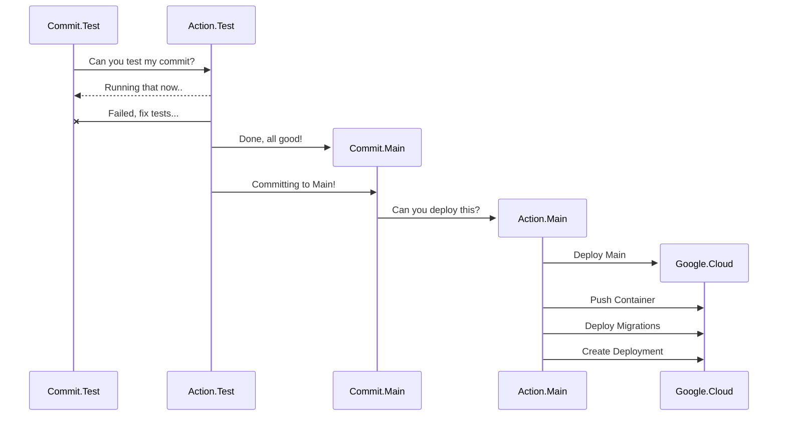

# API Semaphore

## Workflow Diagram

```mermaid
sequenceDiagram
Commit.Test->>Action.Test: Can you test my commit?
Action.Test-->>Commit.Test: Running that now..
Action.Test-xCommit.Test: Failed, fix tests...
create participant Commit.Main
Action.Test->>Commit.Main: Done, all good!
Action.Test->>Commit.Main: Committing to Main!
create participant Action.Main
Commit.Main->>Action.Main: Can you deploy this?
create participant Google.Cloud
Action.Main->>Google.Cloud: Deploy Main
Action.Main->>Google.Cloud: Push Container
Action.Main->>Google.Cloud: Deploy Migrations
Action.Main->>Google.Cloud: Create Deployment
```
