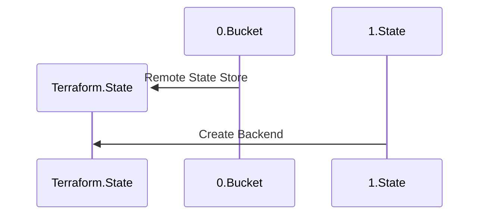
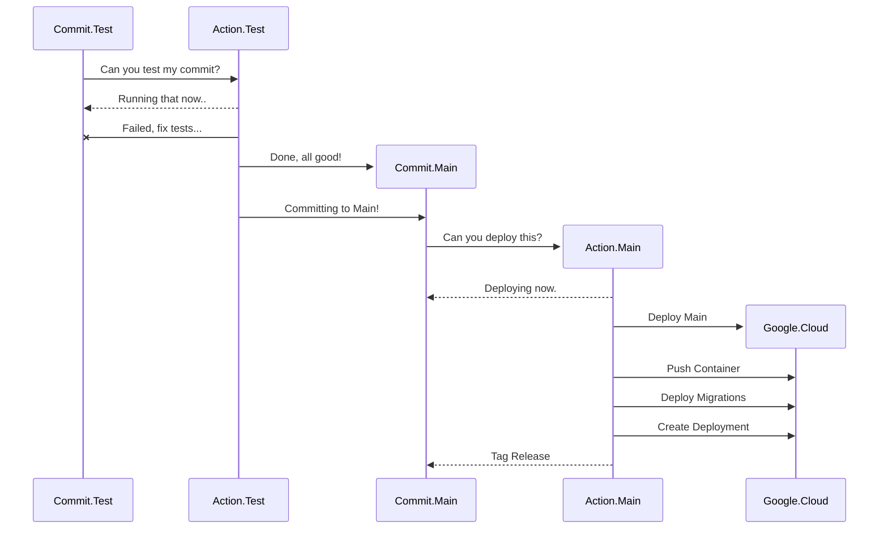

# API Semaphore

Hello

## Terraform Infrastructure Deployment

## Github Workflow Action Sequence

The diagram actors are described as

- Commit.\<Branch\> - a commit to that branch
- Action.\<Branch\> - a workflow action to be taken on that commit
- Google.Cloud - gcloud client actions

